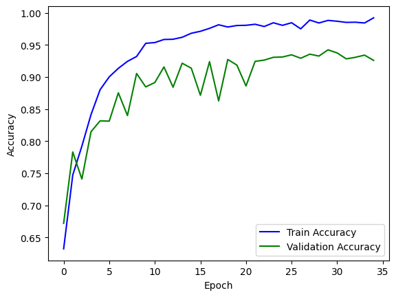
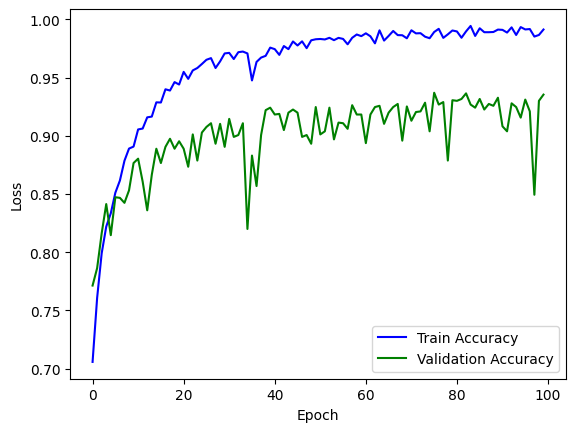

# Model Architecture Review for AD vs CN Classfication

## Introduction

### Brief Overview of the Model Approach
We have tried classification of Brain MRI Scans using following models:
- **Transfer Learning Models** using pretrained **VGG19** and **ResNet152**
- A **3D Convolutional Neural Network (3D CNN)** tailored for volumetric brain scan data
- A **Spatial Graph Convolutional Neural Network (SGCNN)** leveraging spatial relationships within brain structures
- A **Double CNN architecture** combining dual feature extraction paths
- A **Attention-based eXplainability** using 2D CNNs to capture correlations and classify 3D MRIs

For Transfer Learning Models and Double CNN architecture model, we used entropy based slicing to extract key slices of brain scan data as input.
### Problem Statement
This is a **binary classification** problem aimed at distinguishing between two groups:
- **AD (Alzheimer’s Disease)**
- **CN (Cognitively Normal)**

### Model Goals and Objectives
Our key goals include:

- **Accurate classification** of subjects into AD or CN based on neuroimaging features  
- **Evaluating model generalizability** across architectures to identify the most effective solution  
- **Minimizing overfitting**, especially given the relatively limited dataset size.
- **Comparing 2D and 3D strategies** to determine the effectiveness of volumetric data processing  
- **Computationally Cheaper** as we have limited access to resources
## Methodology
Pre-Processing pipeline included Bias-Field correction, Skull-Stripping, Spatial Normalization (MNI) and Intensity Normalization by using [NPP model](#ref3)[3].  
Along with that, due to RAM constraints on the free tiers of Kaggle and Google Colab, we employed a method of 'entropy based selection' to select the top-k (k=100 in our case) slices from each MRI scan based on their relative importance. The model was finally trained using these slices only, they amounted to roughly 25,000 2D slices. Further, 128x128 crops are extracted from the center of each slice to be appended to the design matrix X. Integer labels are used.  
Also, `numpy` is used to ensure shape consistency with the pretrained models.  [Slice Selection using Entropy](#ref2)[2].

### Transfer Learning Models:

#### ResNet152
- **Model Architecture**:
  - A ResNet152 model pretrained on ImageNet is used as the base.
  - All but the last five layers are frozen to retain general features and the fully connected layers were excluded.
  - Three fully connected layers (each with 4096 units) are added, followed by a sigmoid output for binary classification.

- **Training Setup**:
  - Optimizer: Adam with default learning rate.
  - Loss: Binary Crossentropy.
  - Dataset split: 80% training / 20% testing, with 10% validation from the training set.
  - Epochs: 75, Batch size: 64.

#### VGG19 with no preprocessing
  - VGG19 base model is used with all layers frozen along with the same 3 x 4096 units dense layer setup that was used above.
  - Point to be noted, no preprocessing was done on this model's training set, Adam optimiser with a learning rate of `1e-6` was used and the model was trained for 35 epochs.
  - A regular 80-20 train-test split was used along with 10% data from the training set being reserved for validation.

#### VGG19 with preprocessing

   -  This model is similar to the previous one but improves on it by utilising preprocessed data. Optimizer and learning rate and fully connected layer structure also remain the same.

### 3D CNN Model (Scratch):
This Architecture was referenced from [this study](#ref6)[6].
- **Model Architecture** 
*ADNet3D Network*: Implemented 3D convolutional neural network with feature extraction backbone containing 5 convolutional blocks:
  - Block 1: Conv3d(1→32, kernel=3, padding=1) + BatchNorm3d + ReLU + MaxPool3d(2)
  - Block 2: Conv3d(32→64, kernel=3, padding=1) + BatchNorm3d + ReLU + MaxPool3d(2)  
  - Block 3: Conv3d(64→128, kernel=3, padding=1) + BatchNorm3d + ReLU + MaxPool3d(2)
  - Block 4: Conv3d(128→256, kernel=3, padding=1) + BatchNorm3d + ReLU + MaxPool3d(2)
  - Block 5: Conv3d(256→256, kernel=3, padding=1) + BatchNorm3d + ReLU + MaxPool3d(2)

  *Classifier Head*: Two-layer fully connected classifier with 512 hidden units, LayerNorm regularization, ReLU activation, and dropout (p=0.5) for overfitting prevention. Final output layer maps to 3 classes (CN, MCI, AD).
  
- **Training Configuration** 
*Data Splitting Strategy*: Subject-based stratified split (60% train, 20% validation, 20% test) to prevent data leakage between related scans from same subjects. Train set: 275 files, Validation: 92 files, Test: 92 files.

  *Optimization Setup*: CrossEntropyLoss for multi-class classification, Adam optimizer with learning rate 0.001, weight decay 1e-4, batch size 2 (memory constraint), DataLoader with 4 workers and pin_memory enabled for GPU efficiency.
### 3D CNN Model (Pretrained):
- *Mapping Strategy*: Developed shape-based parameter matching that successfully mapped 40 out of 58 available pre-trained parameters including:
  - All convolutional layer weights and biases (8 weight tensors, 32 bias vectors)
  - Batch normalization parameters (weight, bias, running_mean, running_var)
  - Linear layer weights and biases (3 weight matrices, 12 bias vectors)
- *Architecture Consistency*: Maintained identical ADNet3D architecture with 15,572,355 total parameters, ensuring compatibility with pre-trained weights while adapting the final classification layer for the specific ADNI dataset requirements.

- *Parameter Analysis*: Implemented comprehensive parameter shape analysis that categorizes weights by dimensionality:
  - 5D tensors: Conv3d weights
  - 4D tensors: Alternative conv formats  
  - 2D tensors: Linear layer weights
  - 1D tensors: Biases and normalization parameters

- *Mapping Validation*: Verified successful weight transfer through shape compatibility checks and parameter count validation, ensuring proper initialization of the transfer learning model.

- *Optimization Configuration*: Maintained identical hyperparameter settings (Adam optimizer, lr=0.001, CrossEntropyLoss) .
### SGCNN Model:
Takes inspiration from [the paper](#ref7)[7].

**Approach:**
- Used preprocess scans generated using [nppy library](#ref4)[4].
- Takes only top 25 axial scans fom the .nii files
- Segments different image scans using k-means and further uses these to create nodes and edges for graph representation (this can be further develeoped using U-Net segmentation algorithms)
- These graphs are further processed in a SGCNN to train the model
- Also uses a simple CNN sideways, to further merge with SGCNN.
- Classifies into Alzheimer and Normal after using weights from both the models.
- The model is not perfectly ready as of now, training is yet to be done.

### AXIAL:
This model aims to capture and use the relationship between multiple slices by using an Attention XAI Fusion Module and create a final representation of that particular MRI scan and then use it for classification. Basically, this model tries to use global features for an entire MRI scan rather than classify eaach 2D slice by tagging it with its parent label. 
This approach replicates this [paper](#ref5)[5]  with a few tweaks.

- **Feature Extraction Module:**
  - Input: $N$ individual 2D brain slices (e.g., axial MRI slices from a 3D volume). Here, $N$ is selected using the entropy based selection as mentioned above.
  - Process: Each slice is passed through a CNN backbone (ResNet152).
  - Output: A feature tensor of shape $(N,f_dim)$  — where each slice is represented by a vector of length $(f_dim,)$

- **Attention XAI Fusion Module:**
  - Purpose: Aggregate slice-wise features into a single subject-level representation with explainability.
  - Steps:
    - Each feature vector $(f_dim,)$ is passed through a small MLP to compute attention scores.
    - A softmax is applied over the scores.
    - Each feature is multiplied by its attention weight.
    - A weighted sum of all features produces a single vector
  - Output: A single fused feature vector representing the full subject's brain scan.

- **Diagnosis Module:**
  - Input: The fused feature vector from the attention module
  - Process: Fed into a fully connected MLP classifier.
  - Output: Labels corresponding to AD/CN.

### Double CNN Architecture Model:
Double CNN architecture was referred from [this study](#ref1)[1]. It uses a 3 channel image consisting of middle slices of scans of all three temporal dimensions (axial, coronal, sagittal). However, this along with small size of dataset led to overfitting and bad results. To overcome this, we implemented [entropy based slicing](#ref2)[2] of brain scan as input images. We took top 30 images for each scan.
 
Regularization, Dropout, Early Stopping, and Reduce lr on Plateau were used to reduce overfitting of model.
 
- **Training Setup**:
  - Optimizer: Adam with default learning rate.
  - Loss: Binary Crossentropy.
  - Dataset split: 80% training / 20% testing, with 20% validation from the training set.
  - Epochs: 20, Batch size: 25.
## Implementation
Dataset was processed using `/Aayush/processdataset.py` which uses [nppy library](#ref4)[4] based on [NPP model](#ref3)[3].
  **Dependencies:** `tensorflow`, `nibabel`, `cv2`, `numpy`, `pandas`, `matplotlib`  
**Hardware Specification:** Kaggle 2xT4 GPU  

### RESNET 152
The implementation of this model can be found at the path: `/Dabeet/preprocessed-brainspy-resnet152.ipynb`.  

### VGG19:
- **Without Preprocessing** - Implementation can be found at: `/Dabeet/brain-spy.ipynb`.
- **With Preprocessing** - Implementation can be found at: ``/Aayush/preprocessed_data_vgg19.ipynb``.  
### 3D CNN:
- **Scratch** - Implementation can be found at: `/Ram/3d-cnn-on-adni_scratch.ipynb`.
- **Pretrained** - Implementation can be found at: ``/Ram/3d-cnn-on-adni_transfer.ipynb``.  
### AXIAL
  - At the time of writing this, the code for this model is ready but I am unable to train it on Kaggle due to an issue where the GPU is not being detected for training. A CPU based training was forced on Kaggle and estimated training time of ``6 days`` is reported.
  - Latest: Kaggle terminal seems to have crashed, only 3 epochs were executed, I am attaching the code at ``/Dabeet/axial.ipynb`` and the last reported accuracy is ``.754`` after ``3 epochs``.
  - This model seems promising and I would like to try it out with proper resources, currently I am looking to train it locally on my CPU where the training time is estimated to be ~ ``12 hours``.

### Double CNN Architecture:
The Double CNN model was implemented in the notebook located at: `/Aayush/novel-entropy-model.ipynb`.

## Results
### Model Performance Comparison

| Model                         | Accuracy (%)    |
|-------------------------------|-----------------|
| VGG19 (Transfer Learning)     | 93.49           |
| ResNet152 (Transfer Learning) | 96.32           |
| 3D CNN (Scratch)              | 48.45 (Val)     |
| 3D CNN (Pretrained)           | 48.45 (Val)     |
| Double CNN                    | 98.99           |
| SGCNN                         | xx.xx           |
| AXIAL                         | 75.40 (3 epoch) |
### RESNET 152:
  - Training and validation accuracy curves indicate a stable and improving trend, however some overfitting is evident. We wish to test this model on the full dataset before commenting further.
  - The model was evaluated on a separate test set.
  - The final train accuracy plateaus at around ``0.996-0.997`` and above whereas the validation accuracy plateaus at roughly ``0.96``. The final test accuracy is ``0.9632``.

### VGG19 (without Preprocessing):
  - The final test accuracy for this model stood at `0.92`.
  - It is worth to note that the validation-train accuracy plot is much more unstable compared to the previous model.

### VGG19 (with Preprocessing):
   -  The model is now trained for ``100 epochs`` instead of 35 and is able to achieve a final test accuracy of ``0.9349``.
   -  The graph is indicative of slight overfitting but again, we would not like to comment on that before using the entire dataset.

### 3D CNN (Scratch):
-  Training accuracy fluctuated between 44-49% with validation accuracy plateauing around 48.45%
### 3D CNN (Pretrained):
- Achieved improved training stability with validation accuracy consistently reaching 48.45%.
### Double CNN Architecture:
- Double CNN had `0.9899` accuracy on test dataset after training for `20 epochs`. 

## Conclusion
After a comprehensive review of the various contemporary methodologies in AD/CN classification, we find the Double CNN architecture to be the best at classifying and predicting followed by the transfer learning approaching using ResNet152. 
We further state in this conclusion that, AXIAL offers a fresh and attention based perspective to this problem and would like to train it further on better hardware to get results.
## References
[1] El-Assy, A.M., Amer, H.M., Ibrahim, H.M. et al. *A novel CNN architecture for accurate early detection and classification of Alzheimer’s disease using MRI data*. Scientific Reports, 14, 3463 (2024). [https://doi.org/10.1038/s41598-024-53733-6](https://doi.org/10.1038/s41598-024-53733-6)
 
[2] Khan, N.M., Hon, M., & Abraham, N. (2019). *Transfer Learning with intelligent training data selection for prediction of Alzheimer's Disease*. arXiv:1906.01160 [cs.CV]. [https://doi.org/10.48550/arXiv.1906.01160](https://doi.org/10.48550/arXiv.1906.01160)
 
[3] He, X., Wang, A.Q., Sabuncu, M.R. (2023). Neural Pre-processing: A Learning Framework for End-to-End Brain MRI Pre-processing. In: Greenspan, H., et al. Medical Image Computing and Computer Assisted Intervention – MICCAI 2023. MICCAI 2023. Lecture Notes in Computer Science, vol 14227. Springer, Cham. https://doi.org/10.1007/978-3-031-43993-3_25
 
[4] Github Repository for nppy library https://github.com/AG3106/Neural_Pre_Processing
 
[5] Lozupone, G., Bria, A., Fontanella, F., Meijer, F. J. A., & De Stefano, C. (2024). *AXIAL: Attention-based eXplainability for Interpretable Alzheimer's Localized Diagnosis using 2D CNNs on 3D MRI brain scans.* arXiv preprint arXiv:2407.02418.
 
[6] Folego G, Weiler M, Casseb RF, Pires R, Rocha A. Alzheimer's Disease Detection Through Whole-Brain 3D-CNN MRI. Front Bioeng Biotechnol. 2020 Oct 30;8:534592. doi: 10.3389/fbioe.2020.534592. PMID: 33195111; PMCID: PMC7661929.
 
[7] Alharbi, H., Juanatas, R. A., Hejaili, A. A., & Lim, S.-J. (2024). Spectral graph convolutional neural network for Alzheimer’s disease diagnosis and multi-disease categorization from functional brain changes in magnetic resonance images. Frontiers in Neuroinformatics. https://doi.org/10.3389/fninf.2024.1495571
## Team Members
1. Dabeet Das
2. Ram Daftari
3. Aayush Gajeshwar
4. Aditya Goel
